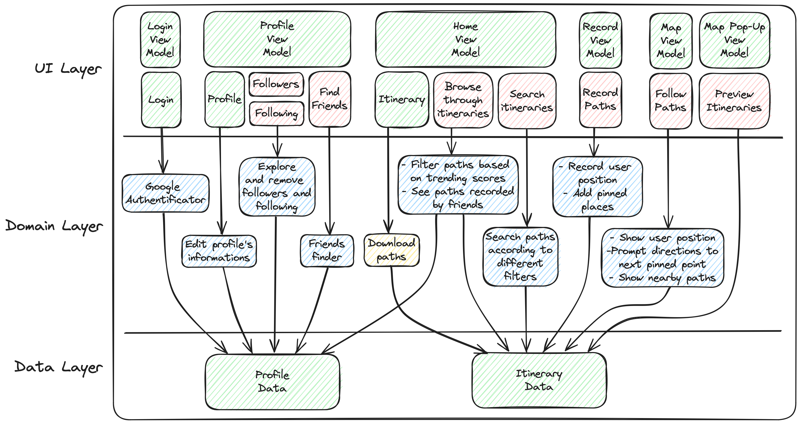

# Functional Requirements

### User registration and login

#### Motivation

In TripTracker, users have to be able to login and register to access the application's 
functionalities. This is a key feature of the MVP because it is the first step in accessing the 
application. Once users are logged in, they can record and save their trips, see trips of others, 
and access other features. After users log in for the first time and their account is created, 
they can then log in without having to register again. Users can also log out of the application at 
any time. They will have to log in again to access their profile and data.

#### Proposed Solution

To register, users have to sign in to the application with their Google account. After logging in
with their Google account, users will be prompted to create a profile, including their name, 
username, profile picture and more. This data is then stored in our Firebase database, where users 
can be uniquely identified by their Google account email address. Therefore, a user cannot change 
their email address once they have registered. To log out of their account, users can use a button 
in the settings section of the application.

### Create an itinerary

#### Motivation

In TripTracker, users need way to document and share their travel experiences in a detailed and 
organized manner. Travelers want to record their routes and highlight spots of interest such as 
landmarks, restaurants, and scenic viewpoints. Sharing these experiences with others can provide 
valuable recommendations and inspire fellow travelers. However, without a structured platform, it 
can be challenging to effectively document and share these itineraries, ensuring they are easily 
accessible and well-preserved.

#### Proposed Solution

TripTracker addresses this need by providing users with the ability to create detailed itineraries 
for their trips. This feature allows users to record their travel routes and add various spots of 
interest along the way. Each spot can include additional details like descriptions and photos, 
enriching the overall travel documentation. Once an itinerary is created, it is shared with other 
users within the application, enabling travelers to showcase their experiences and offer helpful 
recommendations. The itineraries are securely stored in our Firebase database, ensuring they are 
easily retrievable and preserved for future reference. This structured approach facilitates 
effective documentation and sharing of travel experiences, enhancing the overall user experience.

### Follow an itinerary

#### Motivation

Travelers often seek inspiration and guidance from the experiences of others when planning their 
trips. Discovering and following itineraries created by fellow travelers can provide valuable 
insights and suggestions for new destinations and spots of interest. However, without a centralized 
platform to browse and follow these itineraries, travelers might struggle to access and utilize the 
shared experiences of the community. Addition, users may want to revisit their own itineraries or 
replicate past travel routes, requiring a convenient way to access and follow their previous trips.

#### Proposed Solution

TripTracker enhances the travel planning experience by allowing users to follow itineraries created 
by others or themselves. Users can browse through a diverse collection of itineraries shared 
within the community and select the ones that interest them. By following an itinerary, users can 
replicate the travel route and visit the same spots of interest, benefiting from the recommendations 
and experiences of fellow travelers. This feature adds a social dimension to the app, encouraging
users to explore new destinations based on community insights. Within the application, a user can 
favorite an itinerary to save it for future reference, and when they want to see their favorite 
itineraries, they can access them in their profile.

### Follow a user

#### Motivation

Travelers often look for ways to connect with like-minded individuals and gain inspiration from 
their journeys. Being able to follow other travelers and stay updated with their itineraries and
travel experiences can foster a sense of community and provide valuable insights. However, without a
dedicated feature to facilitate this connection, users may find it challenging to keep track of and 
benefit from the travel activities and recommendations of others.

#### Proposed Solution

TripTracker enhances the social aspect of travel by allowing users to follow other users within the
application. To follow a user, a traveler can find them through the "Add Friends" section in the
profile and click on the follow button. Once a user is followed, their itineraries are displayed in 
the "Following" section of the home page, enabling users to stay updated with their travel 
experiences. This feature promotes community engagement and enables users to discover new travel 
destinations and experiences shared by fellow travelers. By following other users, travelers can 
expand their network, gain valuable recommendations, and foster a sense of camaraderie within the 
TripTracker community.

